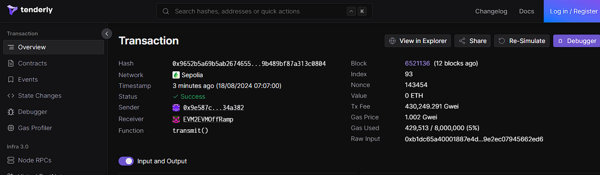

# CCIP BOOTCAMP HOMEWORK DAY 3

Our Task is to estimate the gas used by the ccipReceive Function on the receiver contract and increase the gas limit of the trasferUSDC contract parameter by 10%.

## using Tenderly

After deploying the contracts using the scripts to deploy the contracts SwapTestnetUSDC and the CrossChainReceiver on the Sepolia Testnet.
We invoke the trasferUSDC contract.

Using the transaction hash we can estimate the gas used.

as for my case the **Gas Used** : 429,513

therefore after increasing it 10% it becomes 472,464.3 or 472,464
